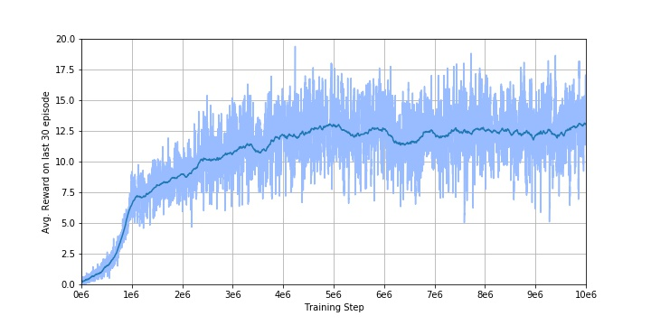

# Deep Q Learning (DQN) - Simple Keras Implementation

## Description

This is an implementation of Deep Q Learning (DQN) playing Breakout from OpenAI's gym.

Here's a quick demo of the agent trained by DQN playing breakout.

 

With Keras, I've tried my best to implement deep reinforcement learning algorithm without using complicated tensor/session operation. In this project, the following techniques have been implemented:

- Deep Q Learning
- Double Q Learning
- Dueling Network

Here's the architecture overview of DNQ model in this work:

 

And the learning curve:

 

The project is derived from an assignment of the course [Applied Deep Learning](https://www.csie.ntu.edu.tw/~yvchen/f106-adl/) I took during 2017 fall, all works are currrently not in maintenance. (But I'll try my best to help if there's question)

## Requirements

The follow packages are required, you can install them with `pip3 install [package]`

- opencv-python
- gym
- gym[atari]
- tensorflow
- keras
- scipy

 
	

## Setup
- Training an agent to play atari game
	
    To train an agent playing Breakout with DQN, simply run

	`python3 main.py --train_dqn`
    
    To activate advanced algorithm such as Double DQN (DDQN)/ Dueling Network, you can run
    
    `python3 main.py --train_dqn --ddqn True`
    
    `python3 main.py --train_dqn --dueling True`
    
    Use the argument `--exp_name` to customize the name of any file saved (model/log) during training.

	You can train the agent to play games different from Breakout by using argument `--env_name [Atari Game Env Name]`

	But you should modify some part of all codes in order to fit the given environment.

    For more parameters availble, please refer to [argument.py]()

- Test the agent's ability
     
     By running the following command, you can get agent's average score in 100 episode
     
     `python3 test.py --test_dqn`
     
     Testing can be performed with the pretrained model training by default or with the model you trained by adding argument `--test_dqn_model_path [your model path]`
     
     To visualize the gaming progress, add `--do_render` to the end. You can also save it to vedio with `--video_dir [path to save]` (set smaller testing episode before doing so)

## References
- [DQN in Keras + TensorFlow + OpenAI Gym by tokb23](https://github.com/tokb23/dqn)
- [A tutorial of Dueling Network by morvanzhou](https://www.youtube.com/watch?v=OiEkaYpPHM0)
- Framework provided by TAs of the course.